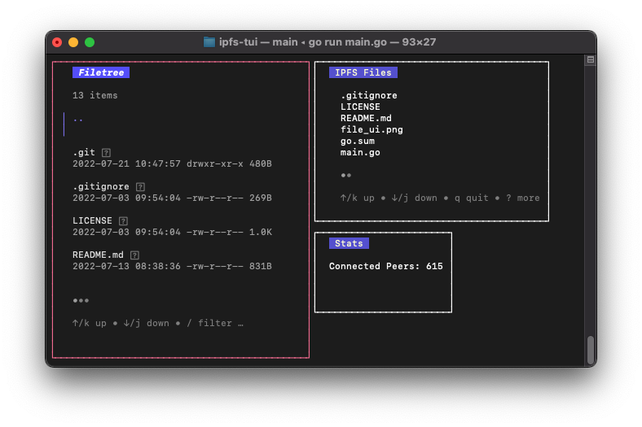

# ipfs-tui
## The Terminal User Interface for Go-IPFS 📠


## Build/Run

Before starting, be sure your local IPFS node is up and running.

```
# clone the repo
git clone https://github.com/jamesthesken/ipfs-tui
cd ipfs-tui

# build and run
go build
./ipfs-tui
```

## Acknowledgements

Libraries used:
* [Bubble Tea](https://github.com/charmbracelet/bubbletea)
* [teacup](https://github.com/knipferrc/teacup) 
* [go-ipfs-api](https://github.com/ipfs/go-ipfs-api)

The structure of this project heavily follows:
* [fm (Bubble Tea Project)](https://github.com/knipferrc/fm) 
* [PJ (Bubble Tea Project)](https://github.com/bashbunni/pjs)

## Navigation

| Key                   | Description                                                |
| --------------------- | ---------------------------------------------------------- |
| <kbd>h or left</kbd>  | Paginate to the left                                       |
| <kbd> or down</kbd>   | Move down in the file tree or scroll pane down             |
| <kbd>k or up</kbd>    | Move up in the file tree or scroll pane up                 |
| <kbd>l or right</kbd> | Paginate to the right                                      |
| <kbd>G</kbd>          | Jump to bottom of file tree or pane                        |
| <kbd>g</kbd>          | Jump to top of file tree or pane                           |
| <kbd>~</kbd>          | Go to home directory                                       |
| <kbd>R</kbd>          | Go to the root directory                                   |
| <kbd>.</kbd>          | Toggle hidden files and directories                        |
| <kbd>ctrl+c</kbd>     | Exit                                                       |
| <kbd>q</kbd>          | Exit if command bar is not open                            |
| <kbd>tab</kbd>        | Toggle between panes                                       |
| <kbd>esc</kbd>        | Blur filetree input                                        |
| <kbd>z</kbd>          | Create a zip file of the currently selected directory item |
| <kbd>u</kbd>          | Unzip a zip file                                           |
| <kbd>c</kbd>          | Create a copy of a file or directory                       |
| <kbd>x</kbd>          | Delete the currently selected file or directory            |
| <kbd>n</kbd>          | Create a new file in the current directory                 |
| <kbd>N</kbd>          | Create a new directory in the current directory            |
| <kbd>r</kbd>          | Rename the currently selected file or directory            |
| <kbd>m</kbd>          | Move the currently selected file or directory              |
| <kbd>e</kbd>          | Open in editor set in EDITOR environment variable          |
| <kbd>y</kbd>          | Copy selected directory items path to the clipboard        |
| <kbd>/</kbd>          | Filter the current directory with a term                   |
| <kbd>?</kbd>          | Toggle filetree full help menu                             |
| <kbd>ctrl+r</kbd>     | Reload config                                              |

## Roadmap

* Add/Remove files to and from IFPS
* Display IPFS node status (connected peers, incoming data, etc.)
* Support local and remote pinning
* Spawn an IPFS node directly from the TUI - similar to IPFS GUI
* Allow user to select color themes
* Possibly more...

## Contributing

Welcome! Feel free to reach out on Discord (jawmes#4960), I would love to collaborate with others on this project. 