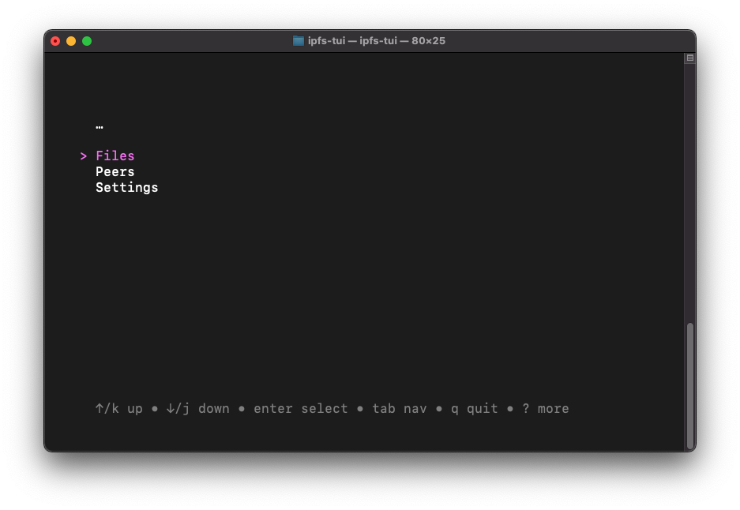

# ipfs-tui
Terminal User Interface for Go-IPFS




## Build/Run
```
# clone the repo
git clone https://github.com/jamesthesken/ipfs-tui
cd ipfs-tui

# build and run
go build
./ipfs-tui
```

## Roadmap

* Add/Remove files to and from IFPS
* Display IPFS node status (connected peers, incoming data, etc.)
* Support local and remote pinning
* Allow user to select color themes
* Possibly more...

## Acknowledgements

Libraries used:
* [Bubble Tea](https://github.com/charmbracelet/bubbletea)
* [teacup](https://github.com/knipferrc/teacup)
* [go-ipfs-api](https://github.com/ipfs/go-ipfs-api)

The structure of this project heavily follows:
* [PJ (Bubble Tea Project)](https://github.com/bashbunni/pjs)
* [fm (Bubble Tea Project)](https://github.com/knipferrc/fm)
